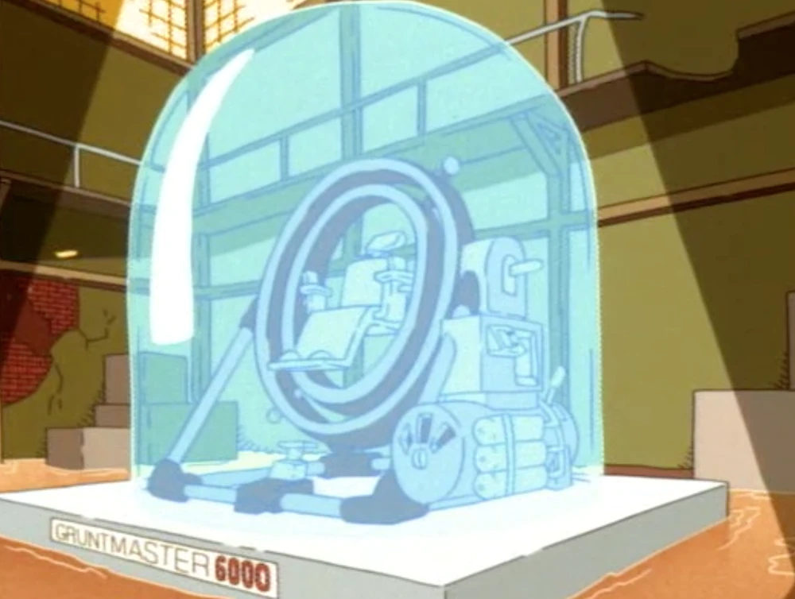
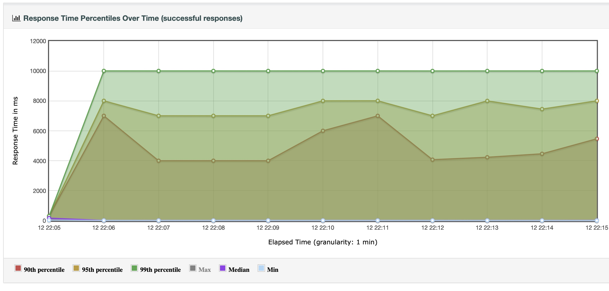
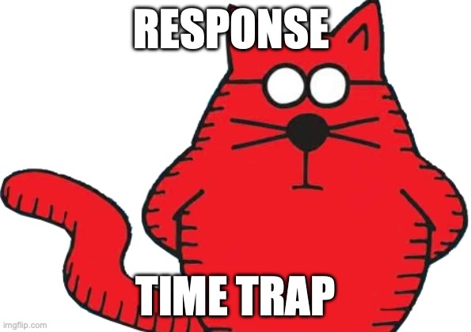

theme: Merriweather,8
# Evil Performance Testing 
#### Siegfried GOESCHL
#### ASCIIFISH

--- 

## About Me

[.column]
* Writing Java backend code
* Infamous for motivation skills & management presentations
* Loves with performance testing & engineering
* Helps at the Java Meetup Vienna & DevFest Vienna
* Never spend enough time on the bicycle.

[.column]


---

## Meet The Pointy Haired Boss 
### Manager @ Path-E-Tech Management

--- 


---

##  Path-E-Tech Management

[.column]
* Merger of **Path-Way Electronics** and **E-Tech Management**
* Located in North America
* They made $$$ with GRUNTMASTER 6000

[.column]


^ Name is unfortunate - can be spelled "Pathetic Management"

---

## Launching GRUNTMASTER 7000


 
---

## Shall You Use GRUNTMASTER 7000?

* You have hard performance requirements
* Performance problems cost you $$$
* Mandatory performance test before purchase

---

## Performance Test Success Criteria

| Metric                            | Acceptance Criteria       |
| :-------------------------------- | ------------------------- |
| Overall Errors                    | 0                         |
| Response Time 99th percentile     | < 50 ms                   |
| Throughput                        | > 50 req/sec              |

^ Define performance test acceptance criteria to be met before using GRUNTMASTER 7000

---

## Looking At The Vendor's Performance Test Results

---

## JMeter Report Overview


^ Impressive average response time & no errors

---

## JMeter Hits Per Second


^ Throughput is much higher than required

---

## JMeter Response Time 99th Percentile


^ Mostly stable performance - no response time peaks

---

## Reviewing Performance Acceptance Criteria

| Metric                            | Criteria                  | Measured                  | Result |
| :-------------------------------- | ------------------------- | ------------------------- | ------ |
| Overall Errors                    | 0                         | 0                         | ✅     |
| Response Time 99th percentile     | < 50 ms                   | ~ 18 ms                   | ✅     |
| Throughput                        | > 50 req/sec              | 80 req/sec                | ✅     |

^ Performance acceptance criteria met and exceeded - everything looks fine

---


---

## GRUNTMASTER 7000
### Mixed End User Feedback

---


---


---


---

## Run Your Own Performance Test

^ Setup own performance test to analyze customers complaints  

---

## JMeter Report Overview


^ Average response time above 1 second?! 

---

## JMeter Hits Per Second


^ Throughput looks strange - should be a nice flat line?!

---

## JMeter Response Time 99th Percentile



^ 99th Percentile is mostly stuck at 10 seconds?

---

## Your Performance Test Results

| Metric                            | Acceptance Criteria       | Delivered                 | Result |
| :-------------------------------- | ------------------------- | ------------------------- | ------ |
| Overall Errors                    | 0                         | 0                         | ✅     |
| Response Time 99th percentile     | < 50 ms                   | ~ 9000 ms                 | ❌     |
| Throughput                        | > 50 req/sec              | 40 req/sec                | ❌     |

^ Performance test criteria are not met :-(

--- 


---

# What Is Right & Wrong?!

| Metric                        | Vendor Test               | Your Tests           | Result | 
| :---------------------------- |:-------------------------:|:--------------------:|:------:|
| Overall Errors                | 0                         | 0                    | ✅     |
| Response Time 99th Percentile | ~ 18 ms                   | ~ 9000 ms            | ❌     |
| Throughput                    | 80 req/sec                | 40 req/sec           | ❌     |

^ The two tests show completely different results - was Path-E-Tech Management cheating?

---


---


--- 

##  Coordinated Omission

[.column]
* Gruntmaster 7000 stalls 10 seconds every minute
* The JMeter worker threads are also stalled up to 10 seconds
* JMeter omitted requests which do not show up in the reports

[.column]


^ Think of stop-the-world GC pause

---

## Coordinated Omission

>  Coordinated omission is a term coined by Gil Tene to describe the phenomenon when the measuring system inadvertently coordinates with the system being measured.
-- https://www.youtube.com/watch?v=lJ8ydIuPFeU

---

## Gil Tene's Original Example


---


---

## Percentiles Charts

* Percentiles are effectively removing information
    * Remove "long runners" and "outliers"
* Never get rid of the maximum value
    * *The number one indicator you should never get rid of is the maximum value. That’s not noise, it’s the signal, the rest is noise.* [^1]

[^1]: Gil Tene, How NOT to Measure Latency

---


---

## Closed Workload Model

* Closed workload model has a fixed number of virtual users
* New users only enter the system when existing users exit
* Think of a call centers agent responding to a call
* Mostly measuring response time

---

## Open Workload Model

* An open system has no control over the number of concurrent users
* New users arrive regardless of the existing number of concurrent users.
* Think of buying Taylor Swift concert tickets
* Mostly measuring service time

--- 


---

## Performance Test Tools & Workload Models

| Test Tool   | Closed Model  | Open Model           |
| :---------- |:-------------:|:--------------------:|
| JMeter      | ✅            | ✅                   |
| Gatling     | ✅            | ✅                   |
| SoapUI      | ✅            | ❌                   |

---


---

## Evil Performance Testing

* Both JMeter test reports are **real**
* Both JMeter tests used a SUT with **exactly the same behavior**
    * The **good** JMeter report uses a **closed workload model**
    * The **bad** JMeter report uses an **open workload model**

--- 

## Evil Performance Testing

* The **closed workload model** is affected by **coordinated omission**
  * JMeter worker threads were blocked by the SUT
* The **99th percentile response time chart** is misleading
    * Omitting the **long runners** and **outliers**
    * Dropped the maximum response time data
    * Effectively hiding the 10 seconds being stalled

---

## Conclusion

* Performance test reports can be misleading
* Percentile charts show you the things you want to see
* Coordinated Omission is everywhere
* Ensure that your workload model reflects reality

^ Tests might be biased - they show what you want to show.
^ Ad 99th percentile - what happened to the remaining 1% of the requests?

---


---


---

## Resources

* [Your Load Generator is Probably Lying to You](https://highscalability.com/your-load-generator-is-probably-lying-to-you-take-the-red-pi/)
* [How NOT to Measure Latency by Gil Tene](https://www.youtube.com/watch?v=lJ8ydIuPFeU)
* [Choosing Open or Closed Workload Models for Performance Testing](https://stormforge.io/blog/open-closed-workloads/)
* [Fixing Coordinated Omission in Cassandra Stress](https://psy-lob-saw.blogspot.com/2016/07/fixing-co-in-cstress.html)
* [Mechanical Sympathy / Coordinated Omission](https://groups.google.com/g/mechanical-sympathy/c/icNZJejUHfE/m/BfDekfBEs_sJ)

---

## Resources

* [ScyllaDB / On Coordinated Omission](https://www.scylladb.com/2021/04/22/on-coordinated-omission/)
* [Why Percentiles Don’t Work the Way You Think](https://orangematter.solarwinds.com/2016/11/18/why-percentiles-dont-work-the-way-you-think/)
* [hey HTTP load generator](https://github.com/rakyll/hey) 
* [SpringBoot HTTPBIN](https://github.com/sgoeschl/springboot-httpbin)

---

## Extra Material

---



---

> Server response time is below one second. If you get time outs, your performance test tool is broken!
-- Typical conversation during performance testing sessions

---

## Response Time Trap

```java
void somewhereInTheServerGuts() {
    long start = System.currentTimeMillis();
    // do the thing ...
    long finish = System.currentTimeMillis();
    long timeElapsed = finish - start;
    println("Processing took: " + timeElapsed);
}
```

^ Some applications publish internal performance data.
Measuring the time between start / end of a work unit.
You measure response time.

---

## Response Time Trap


---

## Response Time Trap

* Some applications publish internal performance data
* Measuring the time between start / end of a work unit
* This is the **response time** and not **service time**
* So the response time could be well below one seconds while the clients have to wait for more than 30 seconds 

---


^ hey is a simple HTTP load generator showing the distribution of response times
^ -c Number of workers, -z Duration
^ 50 requests tool roughly a second and one request 10 seconds
