theme: Merriweather,8
# Evil Performance Testing 
#### Siegfried GOESCHL
#### ASCIIFISH

--- 

## About Siegfried

[.column]
* Writing Java backend code
* Infamous for motivation skills & management presentations
* Likes performance testing & engineering
* Helps at the Java Meetup Vienna & DevFest Vienna

[.column]


--- 

## Meet The Pointy Haired Boss  


^ The Pointy Haired Boss works at Path-E-Tech Management
And PHB is the boss of Dilbert

---

## Path-E-Tech Management

[.column]
* Merger of **Path-Way Electronics** and **E-Tech Management**
* Located in North America
* They made $$$ with GRUNTMASTER 6000

[.column]


^ Name is unfortunate - can be spelled "Pathetic Management".

---

## Launching GRUNTMASTER 7000


^ New flagship product.
Second-best invention after snake oil.
 
---

## Shall You Use GRUNTMASTER 7000?

* You have hard performance requirements
* Performance problems cost you $$$
* Mandatory performance test before purchase

^ You are a prospective customer looking at GRUNTMASTER 7000.

---

## Performance Test Success Criteria

| Metric                        | Acceptance Criteria |
|:------------------------------|---------------------|
| Overall Errors                | 0                   |
| Response Time 99th percentile | < 50 ms             |
| Throughput                    | > 50 req/sec        |

^ Define performance test acceptance criteria to be met before using GRUNTMASTER 7000.

---

## Looking At Path-E-Tech Management's Test Reports

^ After some time Path-E-Tech Management provides JMeter test report to prove "fitness for purpose".

---

## JMeter Report Overview

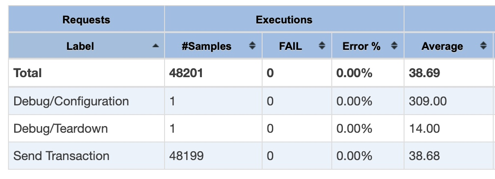

^ Impressive average response time & no errors

---

## JMeter Hits Per Second

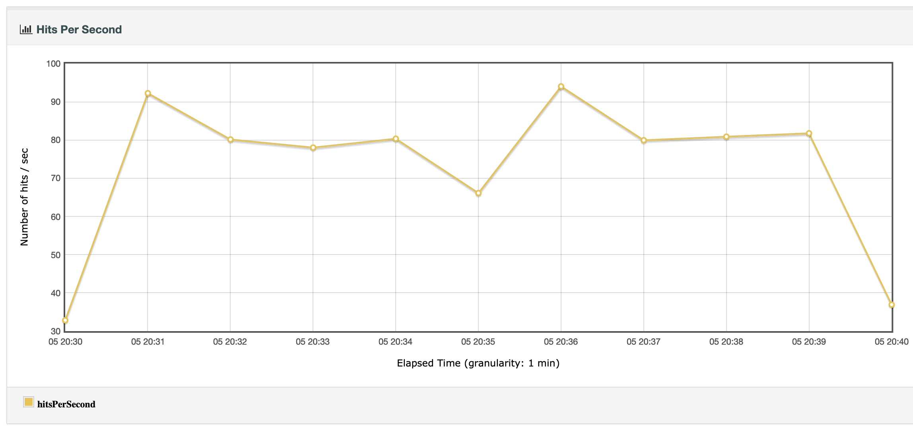

^ Throughput is much higher than required.
Test ramp up and tear down are expected.

---

## JMeter Response Time 99th Percentile

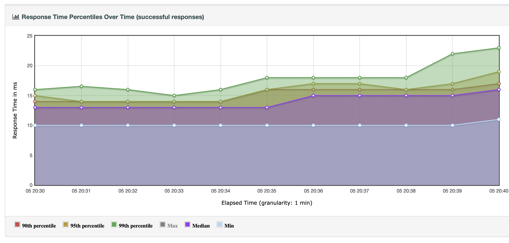

^ Mostly stable performance - no response time peaks.

---

## Reviewing Performance Acceptance Criteria

| Metric                        | Criteria     | Measured   | Result |
|:------------------------------|--------------|------------|--------|
| Overall Errors                | 0            | 0          | ✅      |
| Response Time 99th percentile | < 50 ms      | ~ 18 ms    | ✅      |
| Throughput                    | > 50 req/sec | 80 req/sec | ✅      |

^ Performance acceptance criteria met and exceeded.
Everything looks fine.

---


^ You happily sign the purchase order.

---

## GRUNTMASTER 7000
### Mixed End User Feedback

^ Customer feedback is not overly enthusiastic.

---


^ Complaints everywhere in the social media.

---


^ Even Your Customer Happiness Department sees room for improvement.

---


^ Your annual report review & bonus near.

---

## Run Your Own Performance Test

^ Setup own performance test to analyze customers complaints.

---

## JMeter Report Overview

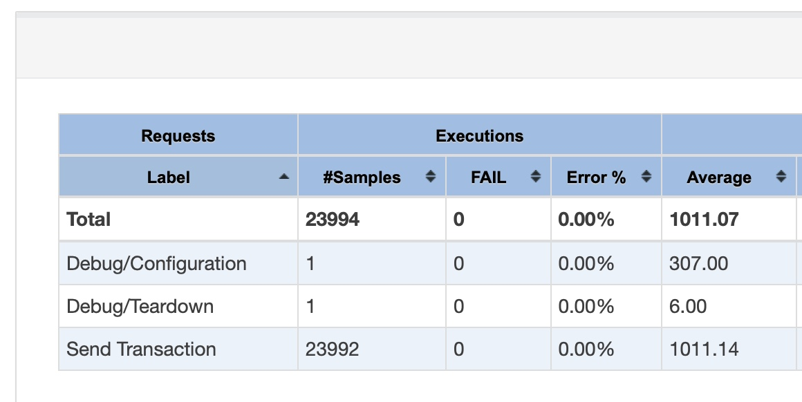

^ Average response time above 1 second?! 

---

## JMeter Hits Per Second

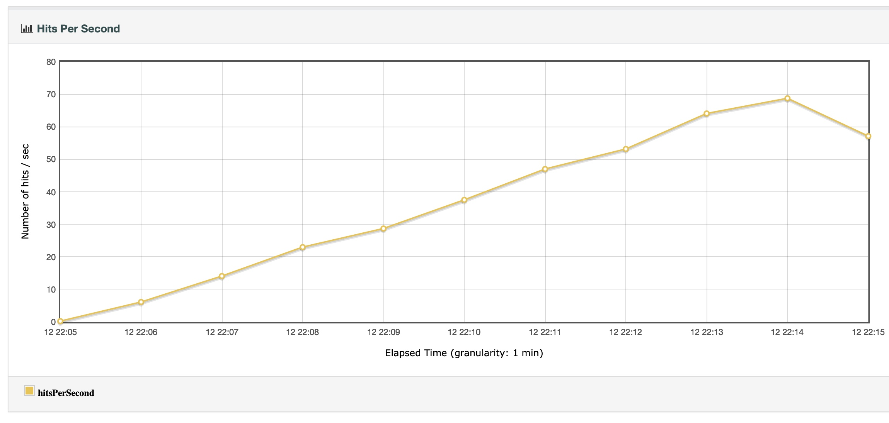

^ Throughput looks strange - should be a nice flat line?!

---

## JMeter Response Time 99th Percentile


^ 99th Percentile is mostly stuck at 10 seconds?

---

## Your Performance Test Results

| Metric                        | Acceptance Criteria | Delivered  | Result |
|:------------------------------|---------------------|------------|--------|
| Overall Errors                | 0                   | 0          | ✅      |
| Response Time 99th percentile | < 50 ms             | ~ 9000 ms  | ❌      |
| Throughput                    | > 50 req/sec        | 40 req/sec | ❌      |

^ Performance test criteria are not met :-(

--- 


---

# What Is Right & Wrong?!

| Metric                        | Path-E-Tech Management | Your Company | Result | 
|:------------------------------|:----------------------:|:------------:|:------:|
| Overall Errors                |           0            |      0       |   ✅    |
| Response Time 99th Percentile |        ~ 18 ms         |  ~ 9000 ms   |   ❌    |
| Throughput                    |       80 req/sec       |  40 req/sec  |   ❌    |

^ The two tests show completely different results?!

---

## Was Path-E-Tech Management Lying About GRUNTMASTER 7000?!

^ You are addressing the elephant in the room - was Path-E-Tech Management  lying?

---


^ There is marketing instead.

---


---


--- 

##  Coordinated Omission

[.column]
* GRUNTMASTER 7000 stalls 10 seconds every minute
* The JMeter worker threads also stall up to 10 seconds
* Stalled JMeter worker threads do not send requests
* Those requests were omitted

[.column]
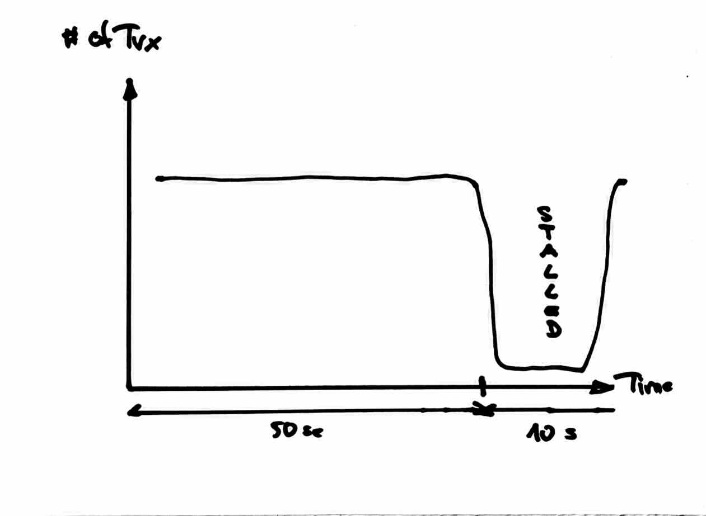

^ Think of stop-the-world GC pause lasting 10 seconds.

---

## Coordinated Omission

>  Coordinated omission is a term coined by Gil Tene to describe the phenomenon when the measuring system inadvertently coordinates with the system being measured.
-- https://www.youtube.com/watch?v=lJ8ydIuPFeU

---

## Gil Tene's Original Example

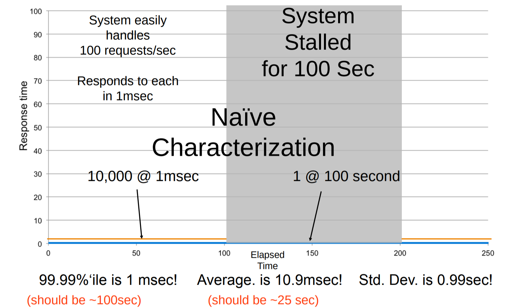

^ Imagine one worker thread doing 10.000 requests in 100 sec.
Then the SUT stalls for 100 seconds which results in one single request in 100 sec.
In other words in this 100 seconds 9.999 requests were omitted.
If you consider all those omitted requests the average response time would be 25 sec.

---


---

## Percentiles Charts

* Used for performance testing and monitoring
* Contain more information that average value
* Percentiles are effectively removing information
    * Remove "outliers / noise " for nicer graphs

^ Big question - are the outliers part of the normal operation?
If so they might be "long runners"?!

---

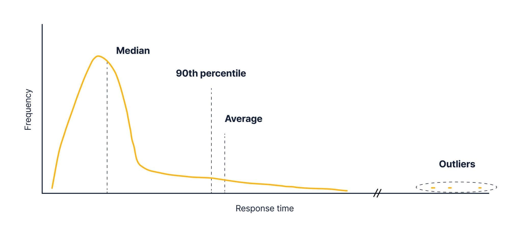

^ "median" is the 50th percentile
"average" is skewed by the long tail

---

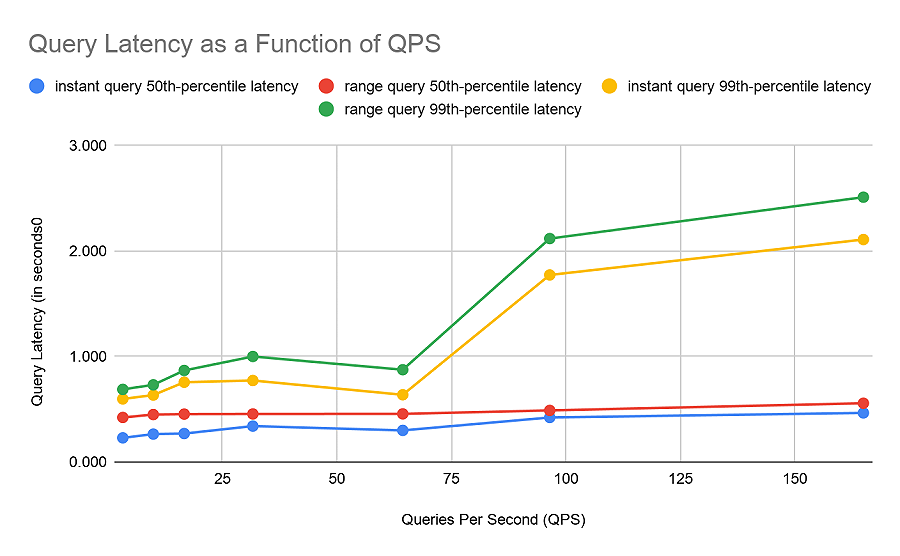

^ Diagram is hiding the maximum response time of ~ 1-2 req / sec
https://grafana.com/blog/2021/04/27/benchmarking-grafana-enterprise-metrics-for-horizontally-scaling-prometheus-up-to-500-million-active-series/

---

> The number one indicator you should never get rid of is the maximum value. That’s not noise, it’s the signal, the rest is noise.
--  Gil Tene, How NOT to Measure Latency

---


---

## Closed Workload Model

* Closed workload model has a fixed number of virtual users
* New users only enter the system when existing users exit
* Think of measuring call center agent performance
* Mostly measuring response time

---

## Open Workload Model

* An open system has no control over the number of concurrent users
* New users arrive regardless of the existing number of concurrent users.
* Think of buying a Taylor Swift concert ticket
* Mostly measuring service time

--- 

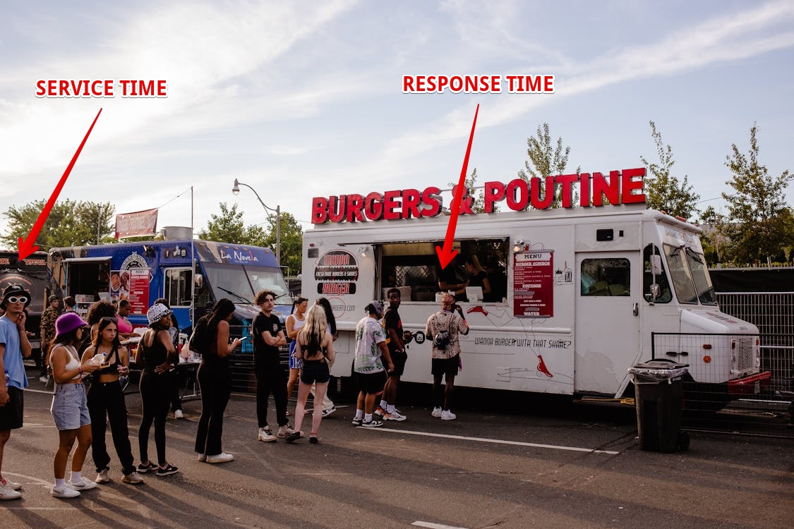

^ Guy in front of the counter sees response time.
The guy on the far left with glasses sees service time.

---

## Workload Models & Test Tools

| Test Tool | Closed Model | Open Model |
|:----------|:------------:|:----------:|
| JMeter    |      ✅       |     ✅      |
| Gatling   |      ✅       |     ✅      |
| SoapUI    |      ✅       |     ❌      |

^ Gatling is commercial tool
Gatling gRPC Plugin is crippled - 5 minute test duration

---

## Was Path-E-Tech Management Doing Evil Performance Testing?!

---

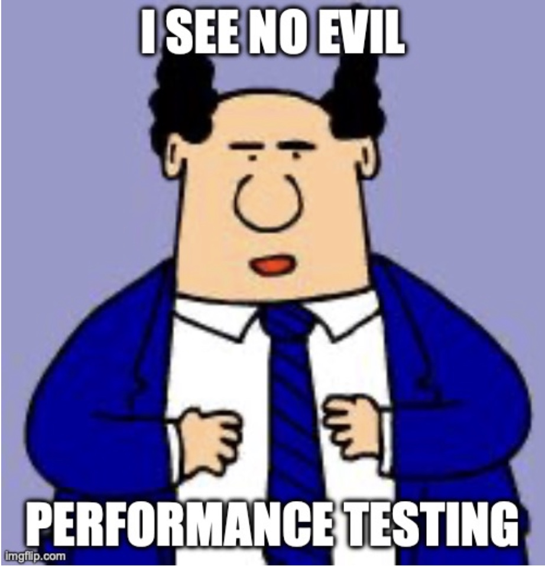

---

## Evil Performance Testing?!

* Both JMeter test reports are **real**
* Both JMeter tests used a SUT with **exactly the same behavior**
    * The **good** JMeter report uses a **closed workload model**
    * The **bad** JMeter report uses an **open workload model**

^ Both JMeters reports you find on GitHub.
Both JMeter test runs experience the same 10-second pauses of GRUNTMASTER 7000.

--- 

## Evil Performance Testing?!

* The **closed workload model** is affected by **coordinated omission**
  * JMeter worker threads were stalled by the SUT
* The **99th percentile response time chart** is misleading
    * Dropped the maximum response time data
    * Effectively hiding the 10 seconds being stalled

---

## Conclusion

* Performance test reports can be misleading
* Percentile charts show you the things you want to see
* Coordinated Omission is everywhere
* Ensure that your workload model reflects your expectations

^ Tests might be biased - what do you want to show?
Ad 99th percentile - what happened to the remaining 1% of the requests?

---

## Last But Not Least - Use Your Brain


---


---

## Resources

* [Your Load Generator is Probably Lying to You](https://highscalability.com/your-load-generator-is-probably-lying-to-you-take-the-red-pi/)
* [How NOT to Measure Latency by Gil Tene](https://www.youtube.com/watch?v=lJ8ydIuPFeU)
* [Choosing Open or Closed Workload Models for Performance Testing](https://stormforge.io/blog/open-closed-workloads/)
* [Fixing Coordinated Omission in Cassandra Stress](https://psy-lob-saw.blogspot.com/2016/07/fixing-co-in-cstress.html)
* [Mechanical Sympathy / Coordinated Omission](https://groups.google.com/g/mechanical-sympathy/c/icNZJejUHfE/m/BfDekfBEs_sJ)

---

## Resources

* [ScyllaDB / On Coordinated Omission](https://www.scylladb.com/2021/04/22/on-coordinated-omission/)
* [Why Percentiles Don’t Work the Way You Think](https://orangematter.solarwinds.com/2016/11/18/why-percentiles-dont-work-the-way-you-think/)
* [hey HTTP load generator](https://github.com/rakyll/hey) 
* [SpringBoot HTTPBIN](https://github.com/sgoeschl/springboot-httpbin)
* [Loom Project: The Revolution of JMeter](https://medium.com/globant/loom-project-the-revolution-of-jmeter-d321486517a8)

---

## Resources

* [Unveiling the Secret: Achieving 50k Concurrent User load using JMeter with 2.5G RAM Only](https://medium.com/@nirmalmewada/unveiling-the-secret-achieving-50k-concurrent-user-load-using-jmeter-with-2-5g-ram-only-51f892b233ce)
* [Better Benchmarking: Your Benchmark Tool Might be Lying to You](https://www.nearform.com/insights/better-benchmarking-benchmark-tool-lying/)
* [hey Performance Test Tool](https://github.com/rakyll/hey)
* [wrk2 Performance Test Tool](https://github.com/giltene/wrk2)
* [oha Performance Test Tool](https://github.com/hatoo/oha)

---

## Questions & Answers

### From The Last Presentation

---

## Replace My Closed Workload Model-Only Test Tool?

* We lived happily with **Closed Workload** Models and **Coordinated Omission** for many years
* Expected that your test reports become skewed when hitting a slow server
* Double-check maximum response times

---

## Help Me - I Only Want To Test A Single URL!?

* JMeter and Gatling have a steep learning curve
* Complete overkill when testing a few static URLs
* Have a look at **wrk2**, **hey** and **oha**

^ Unable to install wrk2 on my M1 Mac

---

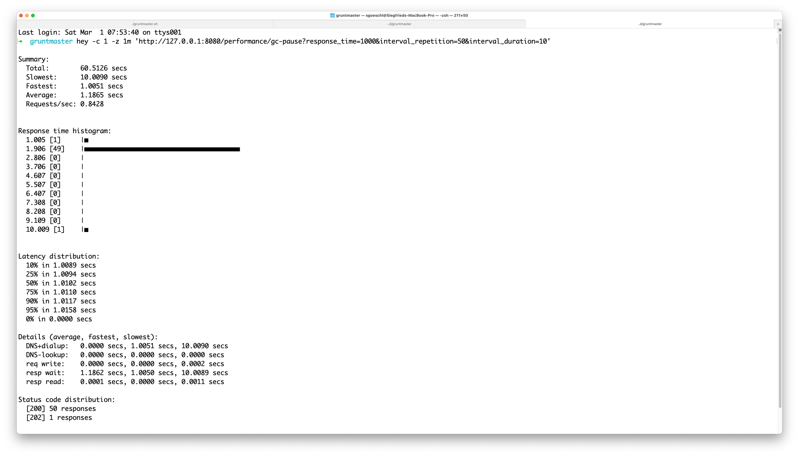

^ hey is a simple HTTP load generator showing the distribution of response times
-c Number of workers, -z Duration
50 requests tool roughly a second and one request 10 seconds

---

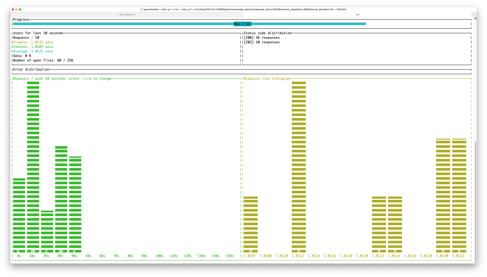

^ Fancy UI for a command line tool

---

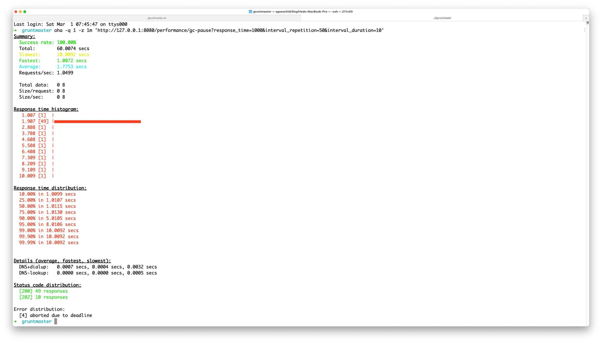

^ Result are very different to hey
59 requests done instead of 50

---

### Coordinated Omission Everywhere

* **hey** uses a number of worker threads
    * Closed Workload Model & Coordinated Omission
    * Issued HTTP 50 requests within 60 seconds
* **oha** uses request by second
    * Open Workload Model
    * Issued 59 HTTP requests within 60 seconds

---


---

## What About JMeter And Project Loom?!

* JMeter implements an **Open Workload Model** by starting more JVM threads
* **JVM threads** are expensive in terms of memory and context switching
* Project Loom provides **Virtual Threads** implemented in JDK 21
* The **JMeter Loom Project** promises much lower memory consumption and better scaling of JMeter

^ JVM thread takes at least 1 MB of memory

---

## Extra Material

---


---

> Server response time is below one second. If you get time-outs, your performance test tool is broken!
-- Typical conversation during performance testing sessions

---

## Response Time Trap

```java
void somewhereInTheServerGuts() {
    long start = System.currentTimeMillis();
    // do the thing ...
    long finish = System.currentTimeMillis();
    long timeElapsed = finish - start;
    println("Processing took: " + timeElapsed);
}
```

^ Some applications publish internal performance data.
Measuring the time between start / end of a work unit.
You measure response time.

---

## Response Time Trap


---

## Response Time Trap

* Some applications publish internal performance data
* Measuring the time between start / end of a work unit
* This is the **response time** and not **service time**
* So the response time could be well below one seconds while the clients have to wait for more than 30 seconds 
